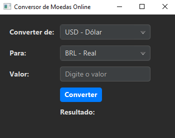

# Conversor de Moedas em JavaFX

Um aplicativo de desktop simples para conversão de moedas, construído com Java e JavaFX. 

As taxas de câmbio são obtidas em tempo real através da ExchangeRate-API.

## 📸 Screenshot

  

## ✨ Funcionalidades

* Converte valores entre diferentes moedas.
* Busca as cotações mais recentes de uma API online.
* Interface gráfica moderna e responsiva criada com JavaFX e CSS.
* Tratamento de erros para falhas de conexão ou entradas inválidas.

## 🛠️ Tecnologias Utilizadas

* **Java 17+**
* **JavaFX 21+** - Para a interface gráfica.
* **Maven** - Para gerenciamento de dependências e do projeto.
* **Gson** - Para processar a resposta JSON da API.
* **[ExchangeRate-API](https://www.exchangerate-api.com)** - Para fornecer as taxas de câmbio.

## 🚀 Como Executar

### Pré-requisitos

* JDK (Java Development Kit) 17 ou superior.
* Apache Maven.
* Uma chave de API da [ExchangeRate-API](https://www.exchangerate-api.com).

### Configuração

1.  **Clone o repositório:**
    ```bash
    git clone https://github.com/LMrAllan/conversor-moedas-javafx.git
    cd conversor-moedas-javafx
    ```

2.  **Configure a Chave de API:**
    * Vá para a pasta `src/main/resources`.
    * Crie um arquivo chamado `config.properties`.
    * Dentro dele, adicione sua chave de API:
        ```properties
        api.key=SUA_CHAVE_DE_API_AQUI
        ```

3.  **Execute o Aplicativo:**
    * Abra um terminal na raiz do projeto e execute o comando Maven:
        ```bash
        mvn javafx:run
        ```